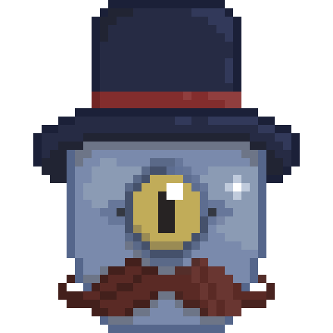

:construction: Projeto em desenvolvimento !! :construction:

<h1 align="center">
  :tophat: HatBot
  

  

  
Um chatbot para vender cursos de ingles

</h1>

  
  
  
  

  
## :scroll: Introdução

O projeto surgiu de uma avaliação da faculdade, porém era uma ideia mais simples, o objetivo era apenas configurar o DialogFlow para gerar um chatbot que vendia um curso de inglês, entretanto nossa equipe decidiu incrementar o projeto e fazer algo com um aspecto mais atrativo e profissional.

## 🧰 Tecnologias usadas
> Para trazer esse aspecto mais profissional precisávamos desenvolver uma interface com uma UI bacana e um back-end que consumisse a API do DialogFlow, e para isso precisávamos de algumas ferramentas, então vamos a elas.

- JavaScript 
- NodeJS 
- ReactJS 
- DialogFlow

## 📷 Imagens do projeto
  
  <!-- aqui eu pensei em colocar umas img gerais do app, e abaixo um gif mostrando como o app funciona -- >
  
